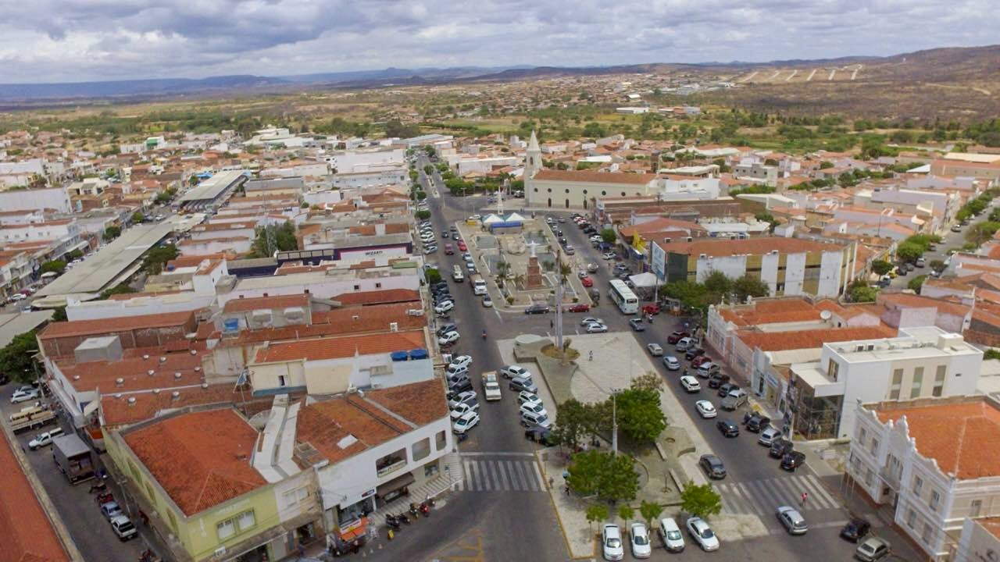
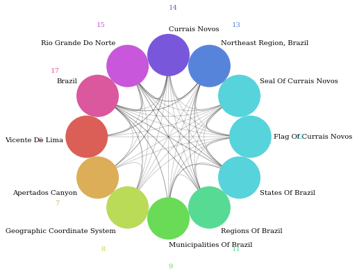
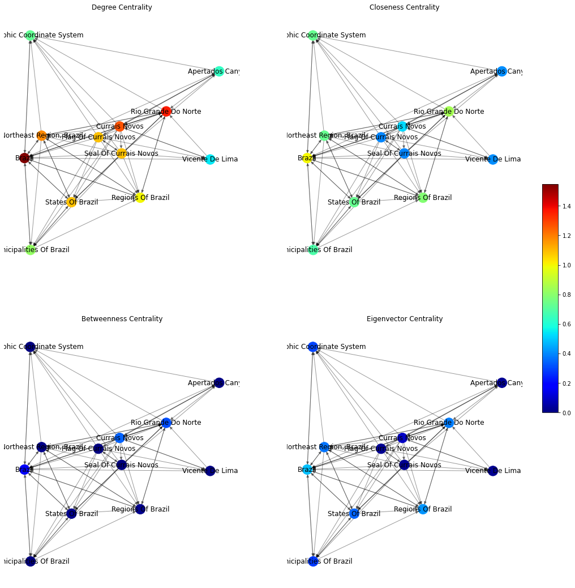
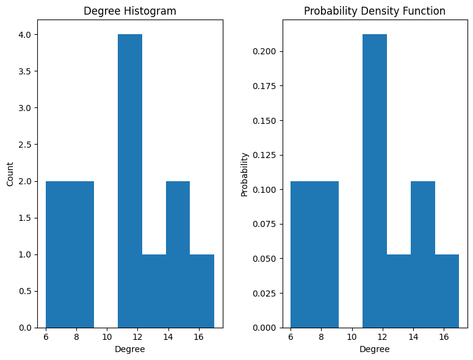
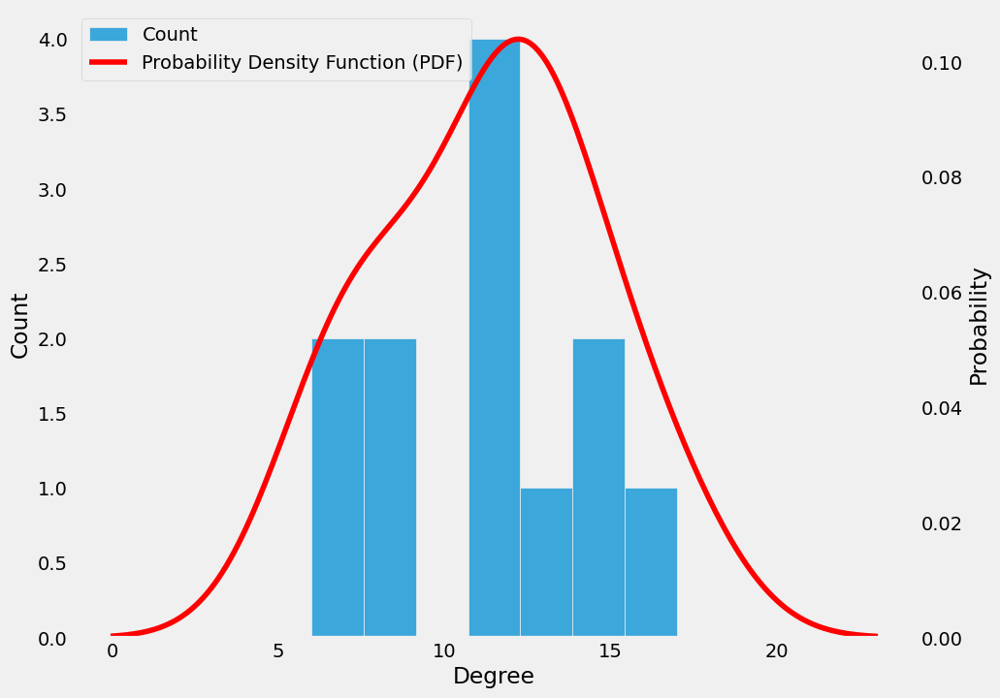
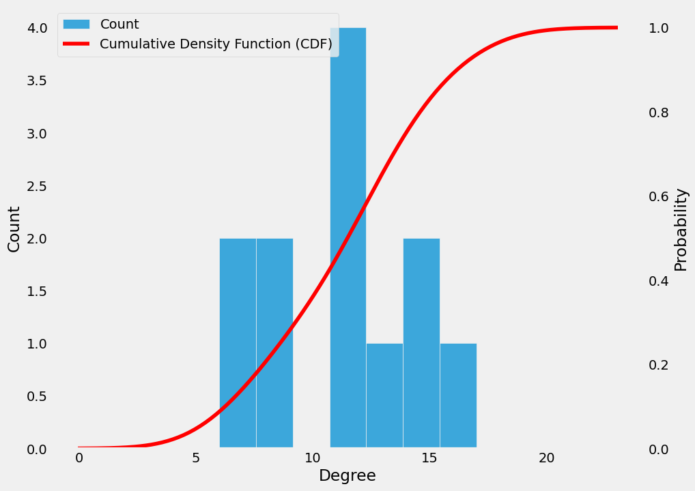
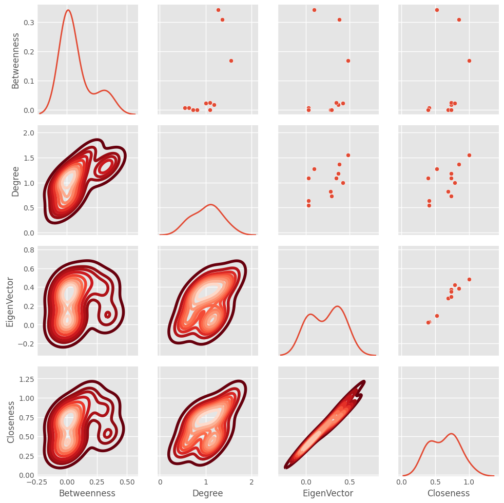
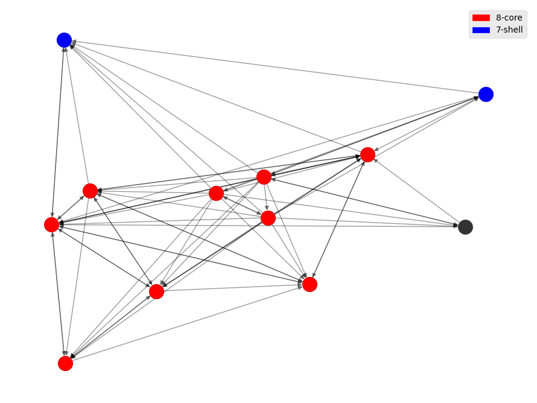
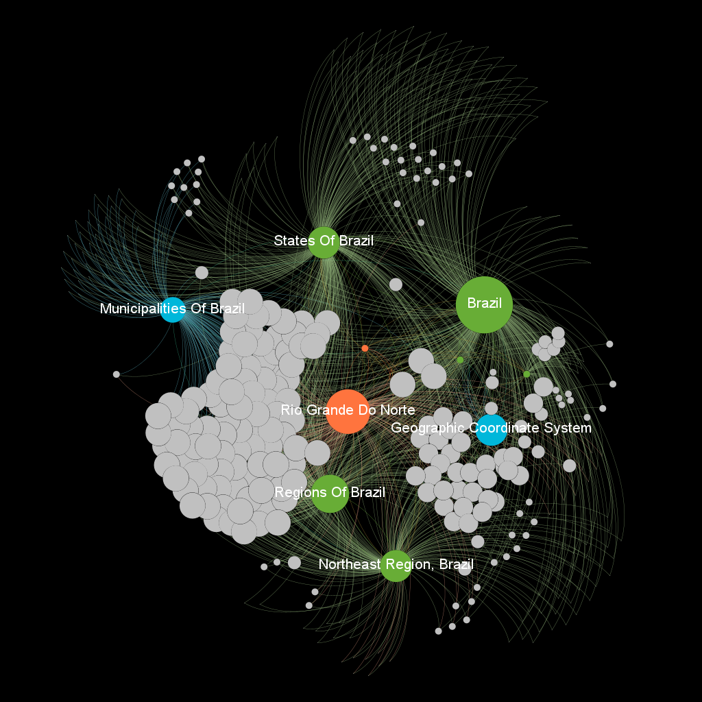
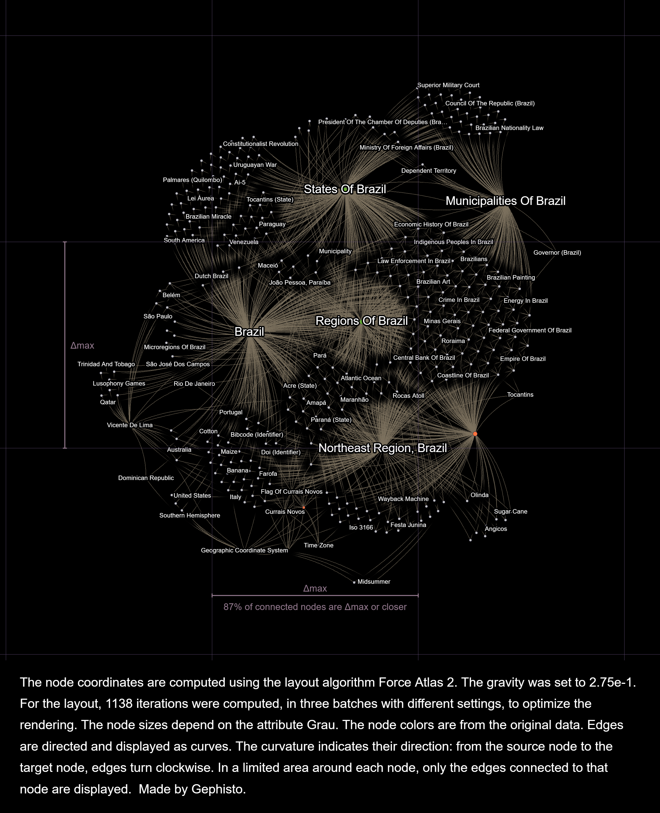

# 🔎 Rede Wikipedia de Currais Novos 

## Membros
1) Fernando Lucas Sousa Silva |  20220080534</p>
2) Teophilo Vitor de Carvalho Clemente | 20220080516</p>

## Objetivo 
Este penúltimo projeto da disciplina tem por objetivo a análise e construção de uma rede com base em um página da wikipédia. Escolhemos para isso, a página wikipedia de Currais Novos, cidade que nós componentes do grupo, nascemos. Para melhor visualização desse README recomendamos usar o GitHub com o fundo branco. 

<p align='center'></p>

## Solução

O notebook contendo todos os códigos produzidos e as análises completas acerca do trabalho pode ser acessado a seguir [](https://github.com/TeophiloVitor/data_structure2/blob/main/week11-12/AEDII_T3U2.ipynb)</p>

Além disso, o vídeo explicando os resultados e desenvolvimento do projeto pode ser acessado a seguir [](https://youtu.be/YAFYkW-f3VA)</p>

Para o desenvolvimento do projeto foram utilizadas as seguintes bibliotecas: nxviz, networkx, wikipedia, pandas, matplotlib e outras. Dado isso, foi feito o processamento dos dados a serem trabalhados, posteriormente, feitas as análises pedidas para o projeto com as dadas visualizações por gráficos como veremos ao longo desta explicação.

## Processamento dos dados

A rede de Currais Novos possui 2557 nós e 3602 arestas, para fins de visualização e retirada de  relações mínimas, filtramos a rede para permanecer somente as que tinha grau maior que 8 e com isso a rede final analisada ficou com 12 nós e 68 arestas, com isso permaneceram somente as relações mais pertinentes como podemos ver a seguir:</p>
```
11 Brazil
9 Rio Grande Do Norte
8 Regions Of Brazil
7 Northeast Region, Brazil
7 States Of Brazil
7 Geographic Coordinate System
6 Municipalities Of Brazil
3 Apertados Canyon
3 Currais Novos
3 Vicente De Lima
2 Flag Of Currais Novos
2 Seal Of Currais Novos
```
Através do gráfico também podemos verificar a representação destas conexões e suas interrelações. Duas relações devemos destacar, apesar de não terem a maior pertinência. A de Vicente de Lima, atleta curraisnovense de renome nacional e internacional por ter participado de 3 olimpíadas e ter conquistado 1 medalha de prata e 1 de  bronze na modalidade de atletismo e Canyon dos Apertados, um ponto turístico da cidade e que faz parte do Geoparque Seridó. A seguir o gráfico que ilustra as relações:

<p align='center'></p>

## Análise das métricas pedidas

As métricas que serão analisadas são: grau, proximidade, autovetor e intermediação. O grau indica o nó com maior grau de acordo com o número de seus vizinhos. A proximidade  indica a distância ou proximidade média do nó. O autovetor verifica se a vizinhança do nó é importante para a rede. Por último, a intermediação é útil para entendimento de fluxo, ela calcula quantas vezes determinado nó fez parte de um caminho entre dois nós distintos.</p>

A seguir temos a imagem que mostra o resultado para cada métrica, ao lado temos uma legenda de cor, do azul (valor baixo) ao vermelho (valor alto), a partir dela podemos visualizar o resultado para cada métrica como podemos ver a seguir:

<p align='center'></p>

## Centralidade

As distribuições de centralidade serão analisadas nos próximos gráficos. Inicialmente vamos analisar o histograma da rede, assim analisaremos o grau de cada nó da rede e com isso, vemos que os nós têm valor de passo distribuído entre 6 e 17 e com um pico no meio.

<p align='center'></p>

Posteriormente foi feita a análise do Gráfico densidade de probabilidade, essa  análise nos mostrará a densidade dos nós em relação a rede de acordo com o grau. Nela podemos ver a curva em vermelho que permeia os dados e notamos como visto anteriormente a distribuição dos valores e a curva que acompanho, principalmente na região central.

<p align='center'></p>

A seguir foi plotado o Gráfico de densidade cumulativa, ele indica a porcentagem de conexões que os nós de determinado grau possuem em relação às conexões da rede. Aqui podemos enxergar a curva em vermelho que começa com o valor baixo e após cresce, isso se dá por ela crescer ao mesmo passo que os valores no histograma crescem e se acumulam e com isso no final ela está no nível mais alto.

<p align='center'></p>

Para efeito de comparação, agora é plotado um gráfico com todas as métricas. Como vemos, devido a termos usado somente às relações com grau maior que 8 em alguns gráficos vemos poucos pontos, mas que nos permitiram analisar os comportamentos. Notamos uma simetria com uma cauda à direita no betwenness, ou seja uma simetria positiva, já nas outras métricas a simetria tendeu a ser normal, temos um comportamento geral de crescimento ao passo que o outro cresce, entretando temos concentração de resultados em alguns pontos como podemos ver a seguir:

<p align='center'></p>

## Decomposição do Núcleo

A decomposição do núcleo tem relação direta à hierarquia de núcleos, para isso analisaremos as métricas, k-core e k-shell. O k-core refere-se a uma sub-rede na qual todos nós possuem pelo menos k vizinhos. Outrossim, os nós que são eliminados para atingir um k-core são chamados de shell. As métricas podem ser vistas na figura a seguir, o core em vermelho e o shell em azul e as suas respectivas ligações.

<p align='center'></p>

## Como executar 

Para executar esse projeto recomendamos que abra um Google Colaboratory e execute o nosso notebook de solução [](https://github.com/TeophiloVitor/data_structure2/blob/main/week11-12/AEDII_T3U2.ipynb), basta executar as células na ordem indicada e obterá a solução aqui visualizada.

# 🔎 Continuação - Projeto unidade 3

## Visualização da rede de Currais Novos

Para o projeto da terceira unidade daremos continuidade a visualização da rede de Currais Novos, desta vez, vamos utilizar outras ferramentas que melhoram a nossa visualização e interpretação dos dados, seriam elas o Gephi, Gephisto e Retina.

## Visualização com Gephi

No projeto anterior, utilizamos de grau>8 para filtrar somente os dados mais relevantes para aquela análise, com isso ficamos com uma rede pequena com `12 nós e 68 arestas`, para essa continuação do projeto mudamos a abordagem, e utilizamos grau>2, com isso ficamos com `416 nós e 1465 arestas`, desse modo, temos a rede mais ampla e com mais dados para explorar com as ferramentas e ter uma melhor visualização geral da rede.</p>

Utilizando-se do Gephi importamos o arquivo `cn.graphml` e para melhor visualização escolhemos o layout ForceAtlas 2, posteriormente executamos as métricas como grau de rede, diâmetro, modularidade, coeficiente de autovetor e excentricidade, essa última métrica foi a que escolhemos para construir a nossa comunidade, a qual chamamos de `Community - Eccentricity`, pois ela apresentou uma divisão bem satisfatória para a rede, evidenciando os nós de maior grau no centro do gráfico em detrimento dos menos relevantes nas extremidades.</p>

Para melhorar mais a visualização da rede usamos a métrica grau para destacar os nós mais importantes, filtramos para graus entre 5 e 11 e com esses resultados nossa rede foi dividida em 4 grupos com seguintes quantidades de membros:</p>
``` 
Grupo 1: 404 membros
Grupo 2: 6 membros
Grupo 3: 2 membros
Grupo 4: 4 membros
```
O grupo 1 que possui mais membros é referente aos nós mais genéricos, com grau menor, já os grupos 2, 3 e 4 são referentes aos nós de maior grau ou mais relevantes, que são os a seguir:</p>
```
Brazil
Rio Grande Do Norte
Regions Of Brazil
Northeast Region, Brazil
States Of Brazil
Geographic Coordinate System
Municipalities Of Brazil
Apertados Canyon
Currais Novos
Vicente De Lima
Flag Of Currais Novos
Seal Of Currais Novos
```
Como resultado dessa divisão em grupos em que temos o destaque dos principais nós e com as filtragens obtemos a seguinte visualização da rede e que também pode ser vista na visualização interativa que pode ser acessada a seguir:</p>

## 🔭 Página de visualização Gephi [[LINK]](https://nandolucas.github.io/CurraisNovos_Network/network/)</p>

<p align='center'></p>

## Visualização com o Gephisto

Outra forma de visualizarmos os dados é usando a ferramenta Gephisto, ela é bem simples e de fácil interação, para executarmos ela apenas carregamos o arquivo [[currais_novos_network]](https://github.com/TeophiloVitor/data_structure2/blob/main/week11-12/currais_novos_network.graphml) obtido do gephi, visto que, nele já temos a rede tratada e com o modelo definido, e em seguida foi fornecida a seguinte visualização:</p> 

<p align='center'></p>

Pelo gráfico podemos ver a divisão em comunidades, algo que era esperado já que usamos o graphml já tratado no gephi, percebemos o destaque em nós como: Brazil, Regions of Brazil, Northeast Region, States of Brazil e outros que devidamente são os de maior grau na rede. Além disso, a sua visualização ficou bastante harmoniosa, pois além dos nós acima citados ela também contemplou outros nós com menor grau mas que também fazem bastante sentido no contexto da cidade de Currais Novos.</p> 

## Visualização utilizando a ferramenta Retina

A última ferramenta de visualização que vamos utilizar é o Retina, ela é uma ferramenta advinda do próprio gephi e permite visualizarmos a rede de forma bem interativa. Ela é bem simples de se utilizar, basta realizar o upload do arquivo [[currais_novos_network]](https://github.com/TeophiloVitor/data_structure2/blob/main/week11-12/currais_novos_network.graphml) e ela gera a visualização segundo as métricas que selecionarmos.</p> 

No vídeo a seguir [](https://www.youtube.com/watch?v=lsPC0c_QaZk) explicamos as métricas que escolhemos e seus resultados de visualização.</p> 

## Referências
-Página Currais Novos no wikipedia [[Link]](https://pt.wikipedia.org/wiki/Currais_Novos)</p>
-Repositório Professor Ivanovitch [](https://github.com/ivanovitchm/datastructure)
