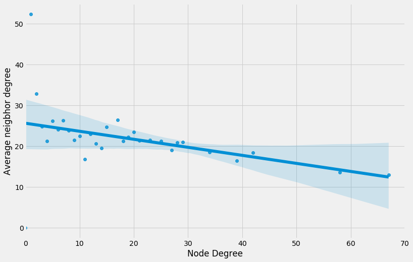

# Projeto Guiado Week9_10

## Membros
1) Fernando Lucas Sousa Silva |  20220080534</p>
2) Teophilo Vitor de Carvalho Clemente | 20220080516</p>

## Objetivos
Este trabalho tem como objetivo realizar uma análise gráfica de voos dentro do território nacional, nele versaremos 4 análises sobre os dados do aéreos, que são:</p>
1) Assortatividade</p>
2) Análise bivariada</p>
3) Grau de conexões</p>
4) Análise do caminho mais curto

## Solução completa
O notebook contendo todos os códigos e resultados para as 4 análises completas acerca do trabalho pode ser acessado aqui[](https://github.com/TeophiloVitor/data_structure2/blob/main/week9-10/Trabalho_2_U2_AEDII.ipynb)</p>

## Assortatividade
Nesta parte analisamos a assortividade da rede em questão, ela representa o grau de relacionamento dos nós com eles mesmo e com outros grupos, no nosso caso as regiões do país e seus voos</p>
Desse modo, para análise geramos um grafo onde é apresentado os relacionamentos entre as regiões, apesar da sua complexidade vemos que os relacionamentos acontecem com mais frequência entre nós de mesma região, o que leva a pensar que está rede tende a ser assortativa, o gráfico gerado está a seguir e também no notebook</p>

<p align='center'></p>

Além disso, para verificar a assortividade geramos a matriz de mistura, ao analisá-la vemos que os elementos da diagonal principal tem os maiores valores, mais uma métrica a favor da rede ser assortativa</p>

<p align='center'></p>

Entretanto a métrica que realmente nós confirmou é o cálculo do coeficiente de assortatividade que pode ser visto a seguir e por ser seu valor mostra que a rede é assortiva</p>

```python 
nx.attribute_assortativity_coefficient(G,"region")
```
0.3676599700857439

## Análise bivariada 
Aqui analisaremos o relacionamento do grau com seus vizinhos,de modo que, os nós de alto grau tendem a se relacionar com outros nós de alto grau, essa é uma rede sortiva. Já uma rede dissortiva, o nós de alto grau se relacionam com mais frequência com nós de menor grau</p>

A nossa análise primeiro foi feita em relação ao país inteiro e após para as regiões, a partir dela constatamos que tanto o país como as regiões seguem a mesma linha. Vemos que quando o grau de um dado nó aumenta, o grau da sua vizinhaça tende a dimnuir, ou seja, nós de alto grau estão se relacionando com nós de baixo grau, o que nós mostra um comportamento dissarsortivo, como vemos nas imagens a seguir</p>

País
<p align='center'></p>
Sul
<p align='center'></p>
Sudeste
<p align='center'></p>
Centro-Oeste
<p align='center'></p>
Norte
<p align='center'></p>
Nordeste
<p align='center'></p>

Para realizar a comprovação da dissarsortividade geramos o coeficiente de assortatividade de grau e vimos que ele foi negativo, comprovando a nossa tese</p>

```python 
nx.degree_assortativity_coefficient(G)
```
-0.19469159153644636

## Grau de conexões
Aqui analisaremos quais compoenetes da rede são conectados, ou seja, através das arestas da rede quem se conecta a quem, de modo a formas subgrafos. A imagem a seguir é da rede total, vemos que ela é bem complexa pois pega todos os dados, porém a seguir faremos uma análise mais minuciosa de dados</p>

<p align='center'></p>

A seguir temos o nosso resultado para as conexões por região, no notebook é possível ver a análise completa</p>

<p align='center'></p>

## Análise do caminho mais curto
Aqui nós selecionamos algumas cidades e seus respectivos códigos de acordo com o critério estabelecido pelo professor e vamos encontrar a partir do dataset o caminho mais curto entre elas, ou seja, quantos aeroportos temos que passar para chegar em tal destino. A seguir podemos ver as cidades e os caminhos gerados, o código completo pode ser visto no notebook</p>

<p align='center'></p>

## Como executar
Para executar esse projeto recomendamos que abra um Google Colaboratory e execute o nosso notebook de solução[](https://github.com/TeophiloVitor/data_structure2/blob/main/week9-10/Trabalho_2_U2_AEDII.ipynb), basta executar as células na ordem indicada e obterá a solução das 4 implementações   

## Referências
-Dataset Alvaro[](https://github.com/alvarofpp/dataset-flights-brazil)</p>
-Repositório Professor Ivanovitch[](https://github.com/ivanovitchm/datastructure)

